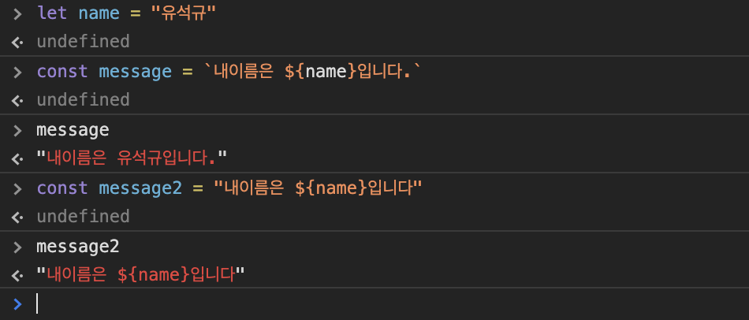
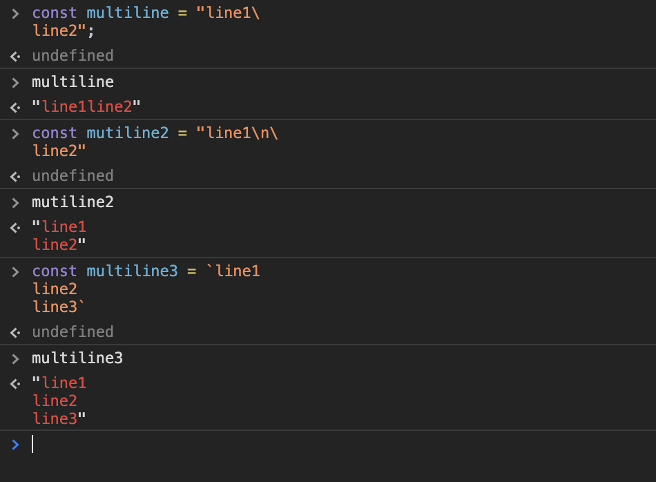

# 3장. 리터럴과 변수, 상수, 데이터 삽입
## 3.1 변수와 상수
- 변수 : 이름이 붙은 값, 변할수 있는 가변 값
- let 은 변수 선언에만 쓰이고 그 이후에는 currentTempC = 44; 등으로 바꿀 수 있다
- 각 변수는 한 번만 선언 할 수 있다.  
(var는 중복 변수 가능, let은 중복 불가)
```javascript
let currentTempC = 22; 
```
- 변수를 선언할때 꼭 초기값을 지정해야 하는건 아님
```javascript
let targetTempC //let targetTempC = undefined;와 같음
```
- let문 하나에서 변수 여러 개를 선언할 수 있다.
```javascript
let targetTempC, room1 = "conference_room_a", room2 = "lobby";
//targetTempC는 값을 할당하지 않으므로 undefined
//room1은 conference_room_a
//room2는 lobby
```
- 상수(constant)는 ES6에서 새로 생겼습니다. 
- 상수도 변수와 마찬가지로 값을 할당받을 수 있지만 한번 할당한 값은 바꿀 수 없습니다.
- 상수 역시 여러 개를 선언할 수 있습니다.
- 절대적인 규칙은 아니지만, 상수 이름에는 보통 대문자와 밑줄만 사용합니다.
```javascript
const ROOM_TEMP_C = 21.5, MAX_TEMP_C = 30;
```
## 3.2 변수와 상수 중 어떤 것을 써야 할까요?
- 될 수 있으면 변수보다 상수를 써야합니다.
- 가변 값보다 고정 값이 제어하기 쉽고 에러를 방지합니다.

## 3.3 식별자 이름
> ### 식별자 규칙
> - 식별자는 반드시 글자나 달러 기호($), 밑줄(_)로 시작해야 합니다.
> - 식별자에는 글자와 숫자, 달러 기호, 밑줄만 쓸수 있습니다.
> - 유니코드 문자도 쓸수 있습니다.
> - 예약어는 식별자로 쓸 수 없습니다. 
> - 식별자는 대문자로 시작해서는 안됩니다.
> - 밑줄이 한 개 또는 두 개로 시작하는 식별자는 아주 특별한 상황, 또는 '내부'변수에서만 사용합니다. 
> - 제이쿼리를 사용할 경우 달러($) 기호로 시작하는 식별자는 보통 제이쿼리 객체라는 의미입니다.

> ### 식별자 표기법
> - 카멜케이스 : camelCase
> - 스테이크 케이스 : snake_case

## 3.4 리터럴
```javascript
let room1 = "conference_room_a"; // 식별자 = "리터럴";
```

## 3.5 원시 타입과 객체
### 원시타입
`
문자열과 숫자같은 원시타입은 불변입니다.
다만 불변성이라는 말이 변수의 값이 바뀔수 없다는 뜻은 아닙니다.
`
- 숫자
- 문자열
- 불리언(Boolean)
- null
- undefined
- 심볼(Symbol)

```javascript
let str = "hello";
str = "world";
```
### 객체

`
객체는 원시 값과 달리 객체는 여러가지 형태와 값을 가질 수 있습니다.
`
- Array
- Date
- RegExp
- Map과 WeakMap
- Set과 WeakSet
- 원시 타입 중 숫자, 문자열, 불리언에는 각각 대응하는 객체 타입인 Number/String/Boolean이 있습니다.
- 이들 객체는 실제 값이 저장되지 않는다. 이들은 대응하는 원시 값에 기능을 제공하는 역할을 한다.

## 3.6 숫자

## 3.7 문자열
문자열은 텍스트 데이터 입니다. 자바스크립트 문자열은 유니코드(Unicode) 텍스트 입니다.  
자바스크립트 문자열 리터럴에는 작은따옴표(''), 큰따옴포(""), 백틱(``)을 사용합니다.  
백틱은 ES6에서 도입한 것이며 템플릿 문자열에서 사용합니다.

### 3.7.1 이스케이프
따옴표 안에 따옴표 사용시 에러가 생깁니다. 이때 역슬래시(`\`)를 써서 따옴표를 **이스케이프** 하면 문자열이 여기서 끝나지 않았다고 자바스크립트에 알릴 수 있습니다.
```javascript
const dialog = "He looked up and said \"Don't do that!\" to Max.";
```

## 3.8 특수문자
역슬래시는 따옴표를 이스케이프할 때만 쓰지 않습니다. 줄바꿈 문자처럼 화면에 표시되지 않는 일부 특수문자나 임의의 유니코드 문자를 나타낼 때도 역슬래시를 사용합니다.

널리쓰이는 특수문자

| 코드 | 설명 | 예제 |
|---|---|---|
| \n | 줄바꿈 문자 | "Line1\nLine2" |
| \r | 캐리지 리턴 | "Windows line 1\r\nWindows line2" |
| \t | 탭 | "Speed:/t60kph" |
| \\' | 이스케이프 | "Don\\`'t" |
| \\" | 이스케이프 | 'Sam said \\"hello\\".'|
| \\\` | 백틱 | \`New in ES6: \\\` string` |
| \\$ | 달러기호 | \`New in ES6: ${interpolation}\`|
| \\\ | 역슬래시 | "Use \\\\\\\\ to represent \\\\!"|
| \uXXXX | 임의의 유니코드 포인트. 여기서 XXXX는 16진수 코드 포인트 입니다.| "Do Morgan's law: \u2310(P \\u22c0Q)"|

### 3.8.1 템플릿 문자열
템플릿 문자열은 문자열의 정해진 위치에 값을 채워 넣는 간단한 방법입니다. 문자열 템플릿에는 **큰 따옴표나 작은 따옴표를 쓰지않고 백틱(`)을 사용합니다.**



### 3.8.2 여러줄 문자열



### 3.8.3 숫자와 문자열
숫자를 따옴표 안에 넣으면 그건 숫자가 아니라 문자열입니다.
```javascript
const result1 = 3 + '30'; // 3이 문자열로 바뀝니다. 결과값은 문자열 '330'입니다.
const result2 = 3 * '30'; // '30'이 숫자로 바뀝니다. 결과값은 숫자 90입니다.
```

## 3.9 불리언 
불리언은 true와 false 두가지 값 밖에 없는 데이터 타입입니다.
```javascript
let heating = true;
let cooling = false;
```

## 3.10 심볼(Symbol)
심볼은 유일한 토큰을 나타내기 위해 ES6에서 도입한 새 데이터 타입으로 **심볼은 항상 유일합니다.** 다른 어떤 심볼과도 일치하지 않습니다.
```javascript
const RED = Symbol("The color of a sunset!");
const ORANGE = Symbol("The color of a sunset!");
RED === ORANGE // false : 심볼은 모두 서로 다릅니다.
```
우연히 다른 식별자와 혼동해서는 안되는 고유한 식별자가 필요하다면 심볼을 사용.

## 3.11 null과 undefined
null과 undefined 이 둘의 **공통점은 모두 존재하지 않는것을 나타낸다**는 점이고 **차이점은 null 은 프로그래머에게 허용된 데이터 타입이며 undefined는 JS 자체에서 사용**한다.
```javascript
let currentTemp; // 암시적으로 undefined입니다.
let targetTemp = null; // 대상온도는 null, 즉 '아직 모르는' 값입니다.
currentTemp = 19.5; // currentTemp에는 이제 값이 있습니다.
currentTemp = undefined; // currentTemp는 초기화되지 않은 듯합니다. 권장하지 않습니다.
```

## 3.12 객체
원시타입은 단 하나의 값만 나타낼 수 있고 불변이지만, 이와 달리 객체는 여러 가지 값이나 복잡한 값을 나타낼수 있으며, 변할수도 있습니다. 즉 컨테이너 본질을 가지고 있습니다. 컨테이너의 내용물이 바뀌어도 본질인 컨테이너 그 자체는 바뀌지 않는다는 의미 입니다.
```javascript
const sam1 = {
    name: 'Sam',
    age : 4,
};

const sam2 = {name: 'Sam', age : 4}; // 한 줄로 선언

const sam3 = {
    name: 'Sam',
    classification : {       //프로퍼티 값도 객체가 될수 있습니다. 
        kingdom: 'Anamalia',
        phylum: 'Chordata',
        class: 'Mamalia',
        order: 'Carnivoria',
        family: 'Felidae',
        subfamily: 'Felinae',
        genus: 'Felis',
        species: 'catus'
    }
};
```
이 예제에서 sam1과 sam2의 프로퍼티는 똑같지만, 둘은 서로 다른 객체입니다. 원시 값과는 반대입니다. (값이 숫자 3인 두 변수는 같은 원시 값을 가리킵니다.)  
sam3의 classification프로퍼티는 그 자체가 객체입니다.
```javascript
sam3.classification.family;      //"Felidae"
sam3["classification"].family;  //"Felidae"
sam3.classification["family"];  //"Felidae"
sam3["classification"]["family"]//"Felidae"
```
객체에 함수를 담을 수도 있습니다.
```javascript
sam3.speak = function(){ return : "Meow!"; };

sam3.speak();       // 결과값은 "Meow!"
```
마지막으로 객체에서 프로퍼티를 제거할때는 delete 연산자를 사용합니다.
```javascript
delete sam3.classification;     //classification 트리 전체가 삭제됐습니다.
delete sam3.speak;              //speak 함수가 삭제 됐습니다.
```
## 3.13 Number, String, Boolean 객체
이들 객체에는 두가지 목적이 있습니다. 하나는 Number.INFINITY 같은 특별한 값을 저장하는 것이고, 다른 하나는 함수 형태로 기능을 제공하는 것입니다.
```javascript
const s = "hello";
s.toUpperCase();        //결과 값 "HELLO"
```
```javascript
const s = "hello";
s.rating = 3;       // 에러가 없습니다. 성공?
s.rating;           // underfined
```
일시적인 String 객체에 프로퍼티를 할당함. 임시 객체는 즉시 파괴되므로 s.rating은 undefined입니다.

## 3.14 배열
자바스크립트 배열은 특수한 객체 입니다.  
특징
- 배열 크기는 고정되지 않습니다. 언제든 요소를 추가하거나 제거할 수 있습니다.
- 요소의 데이터 타입을 가리지 않습니다. 즉, 문자열만 쓸 수 있는 배열이라던가 숫자만 쓸 수 있는 배열 같은 개념이 아예 없습니다.
- 배열 요소는 0으로 시작합니다.
```javascript
const a1 = [1, 2, 3, 4];            //숫자로 구성된 배열
const a2 = [1, 'two', 3, null]      //여러 가지 타입으로 구성된 배열
const a3 = [                        //여러 줄로 정의한 배열
    "What the hammer? What the chain?",
    "In what furnace was thy brain?",
    "What the anvil? What dread grasp",
    "Dare its deadly terrors clasp?",
];
const a4 = [                        //객체가 들어있는 배열
    {name: "Ruby", hardness: 9},
    {name: "Diamond", hardness: 10},
    {name: "Topaz", hardness:8}
];
const a5 = {                        //배열이 들어있는 배열
    [1, 3, 5],
    [2, 4, 6]
}
```
배열 요소에는 숫자를 반환하는 length 프로퍼티가 있습니다.
```javascript
const arr = ['a', 'b', 'c'];
arr.length;         //결과값은 3
```
배열 요소에 접근할때는 대괄호 안에 요소의 인덱스 숫자를 씁니다.
```javascript
const arr = ['a', 'b', 'c'];
// 첫번째 요소를 가져옵니다.
arr[0];                       // 결과값은 'a'
// arr의 마지막 요소의 인덱스는 arr.length-1 입니다.
arr[arr.length - 1];          // 결과값은 'c'
```
배열 요소의 값을 덮어쓸때는 새 값을 할당 합니다.
```javascript
const arr = [1, 2, 'c', 4, 5];
arr[2] = 3;         //arr = [1, 2, 3, 4, 5]
```
## 3.15 객체와 배열 마지막의 쉼표

## 3.16 날짜
자바스크립트의 날짜와 시간은 내장된 Date 객체에서 담당합니다.
```javascript
const now = new Date();
now;        //Wed Apr 03 2019 14:48:48 GMT+0900 (한국 표준시)
```

특정날짜에 해당하는 객체
```javascript
const birthday = new Date(1987, 4, 12);     //월은 0에서 시작합니다. 
                                            //즉 4는 5월입니다.
const birthdayTime = new Date(1987, 4, 12, 10, 0); //10:00
```
```javascript
birthdayTime.getFullYear();         //1987
birthdayTime.getMonth();            //5
birthdayTime.getDate();             //12
birthdayTime.getDay();              //2 (1:월, 2:화, 3:수, 4:목, 5:금, 6:토, 0:일)
birthdayTime.getHours();            //10
birthdayTime.getMinutes();          //0
birthdayTime.getSeconds();          //0
birthdayTime.getMilliseconds()      //0
```
## 3.17 정규표현식
정규표현식은 여러가지 프로그래밍 언어에서 일종의 확장으로 제공하며, 문자열에서 필요한 복잡한 검색과 교체 작업을 비교적 단순하게 만듭니다.
```javascript
// 극히 간단한 이메일 정규표현식
const email = /\b[a-z0-9._-]+@[a-z_-]+(?:\.[a-z]+)+\b/;
```

## 3.18 맵과 셋
- 맵은 객체와 마찬가지로 키와 값을 연결하지만, 특정 상황에서 객체보다 유리한 부분이 있습니다.
- 셋은 배열과 비슷하지만 중복 허용이 되지않습니다.
- WeakMap, WeakSet은 ES6에서 새로 도입
- 둘은 맵과 셋과 마찬가지로 동작하지만 특정 상황에서 성능이 더 높아지도록 일부기능을 제거한 버전입니다.
## 3.19 데이터타입 변환
### 3.19.1 숫자로 바꾸기
Number 객체 생성자를 사용 하는 방법
```javascript
const numStr = "3333";
const num = Number(numStr);     //이 행은 숫자 값을 만듭니다.
                                //Number 객체의 인스턴스가 아닙니다.
```
두번째 방법은 내장 함수인 parseInt나 parseFloat 함수를 사용하는 방법
```javascript
const a = parseInt("16 volts", 10); //"volts"는 무시됩니다. 10진수 16입니다.
const b = parseInt("3a", 16);       //16진수 3a를 10진수로 바꿉니다. 결과는 58입니다.
const c = parseFloat("15.5 kph");   //"kph"는 무시됩니다. parseFloat는 항상
                                    //기수가 10이라고 가정합니다.
```
Date 객체를 바꿀때는 valueOf() 메서드를 사용합니다.
```javascript
const d = new Date();               //현재 날짜
const ts = d.valueOf();             //UTC 1970년 1월 1일 자정으로부터
                                    //몇 밀리초가 지났는지 나타내는 숫자
```
불리언 값을 1(true) 이나 0(false)으로 바꿔야 할 때도 있습니다. 이렇게 변환할 때는 조건 연산자를 사용 합니다.
```javascript
const b = true;
const n = b ? 1 : 0;
```

### 3.19.2 문자열로 변환
자바스크립트의 모든 객체에는 문자열 표현을 반환하는 toString() 메서드가 있습니다.
```javascript
const n = 33.5;
n;      // 33.5 - 숫자열
const s = n.toString();
s;      // "33.5" - 문자열
const arr = [a, true, "hello"];
arr.toString();                 // "1, true, hello" - 문자열
```

### 3.19.3 불리언으로 변환
부정 연산자(!)를 써서 모든 값을 불리언으로 바꿀수 있습니다.
```javascript
const n = 0;            // 거짓 같은 값
const b1 = !!n;         // false
const b2 = Boolean(n)   // false
```