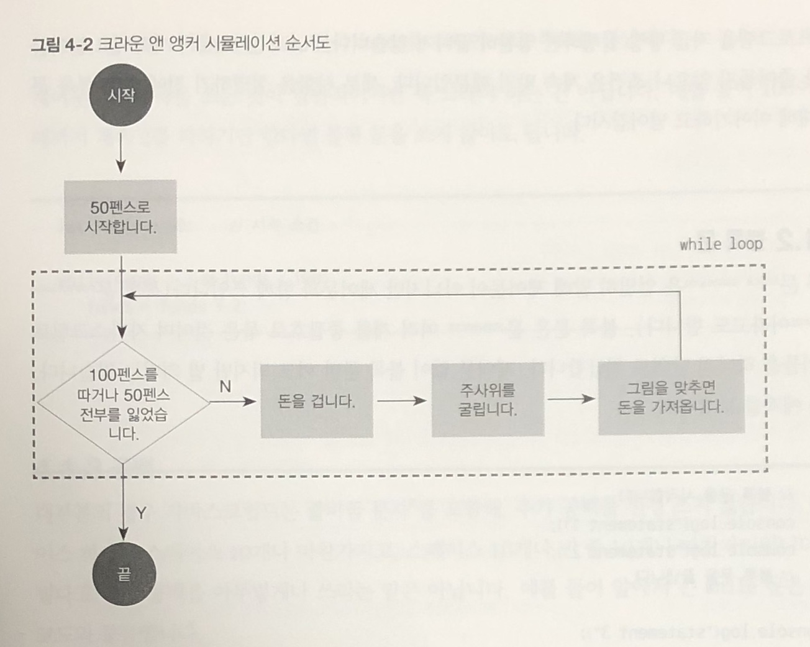
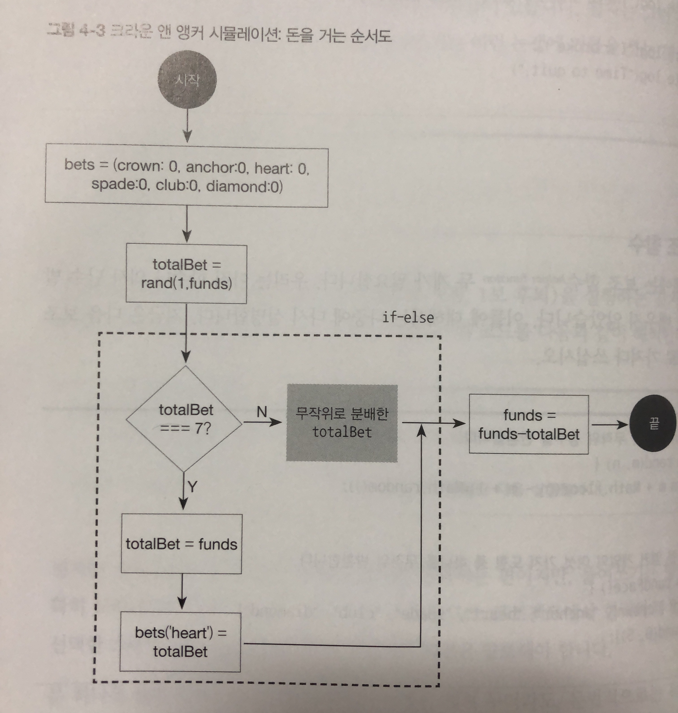
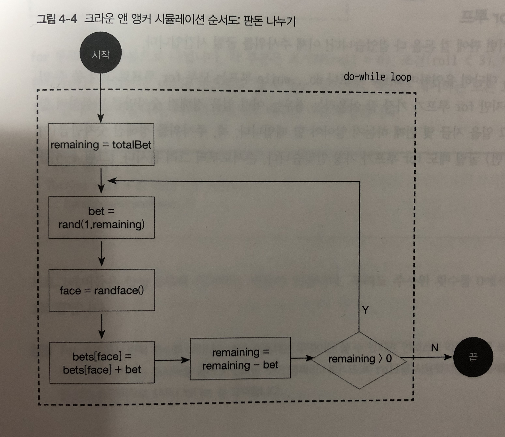
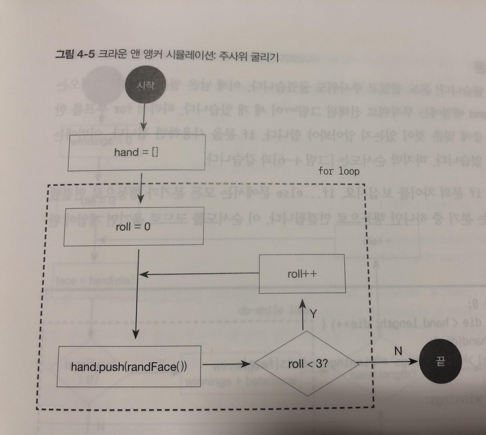
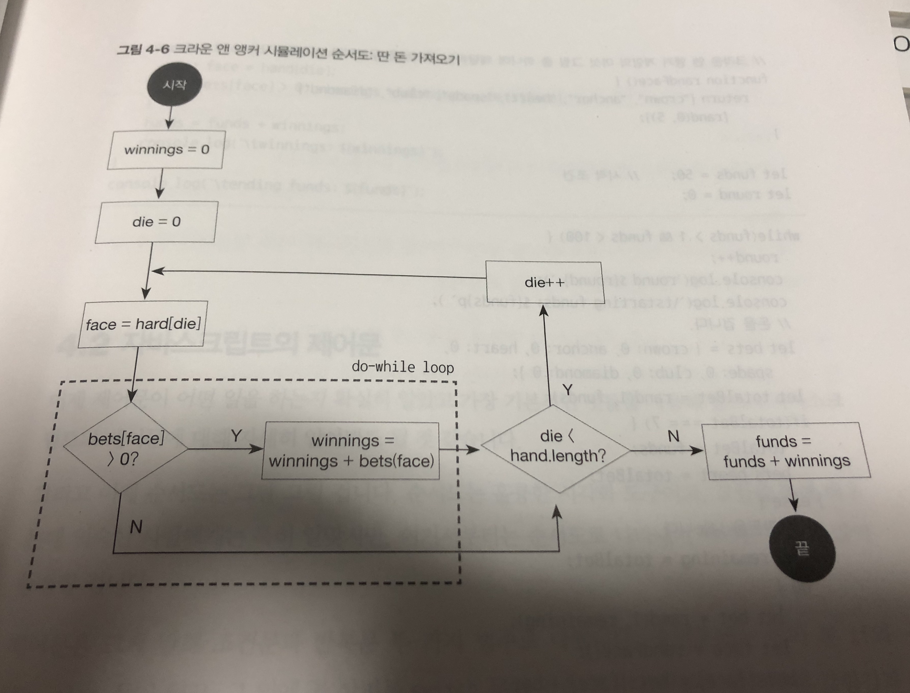

# 4장. 제어문 


## 4.1 제어문 기초 (조건문, 반복문)

- 주사위 게임 크라운 앵커 게임

 > - 여섯개의 사각형 : 크라운 , 앵커, 하트 , 클럽,  스페이드 , 다이아몬드 
 > - 그 사각형에는 마음대로 돈을 걸수있음
 > - 평면에 있는 사각형 숫자와 일치하는 6면체 주사위를 세개 굴림
 > - 이 주사위가 사각형 번호에 일치하는 숫자가 멈추면 거기에 건 돈만큼 딴다 . 
 > - 시작조건은 자본금 50에서 시작 , 끝내는 조건은 100을 얻거나 전부를 잃을때 까지 계속 한다.

| 거는 돈 | 주사위결과  | 따는돈 |
|---|---|---|
| 크라운에 5펜스 | 크라운,크라운,크라운 | 15펜스 | 
| 크라운에 5펜스 | 크라운,크라운,앵커 | 10펜스 | 
| 크라운에 5펜스 | 크라운, 하트, 스페이드 | 5펜스 |
| 크라운에 5펜스 | 하트, 앵커, 스페이드 | 0 | 
| 크라운에 3펜스
 스페이드에 2펜스  |크라운, 크라운,크라운 | 9펜스
크라운에 3펜스 
 스페이드에 2펜스 | 크라운, 스페이드, 앵커 | 5펜스
| 모든 사각형 1펜스씩  | 어떤 주사위가 나오든 | 3펜스



 > - funds(자본금) = 50 , bets(건 돈)= {} , hand=[ ] :변수 할당  배열
 > - rand(1,6) : m이상 n 이하의 무작위 정수  (rand 보조함수)
 > - randFace() : 하트, 크라운 등 결정하는 무작위 문자열 
 > - bets[“heart”]= 5 , bets[randFace()]=5  : 객체 프로퍼티 할당
 > - hand.push (randFace()) : 배열에 요소 추가 
 > - funds - totalBet, funds + winnings : 간단한 사칙연산
 > - roll++ (++은 roll 변수에 1을 더한다는 의미) : 증가

순서도 :
 - 사각형 (행동)
 - 원 (시작과 끝)
 - 마름모 (예/아니오 결정)

```javascript

숫자 비교 : funds > 0 , funds < 100
일치 비교 : totalBet === 7 // 거는돈은 총 7과 일치)
논리연산자 : funds > 0 && funds < 100 (&& : 그리고)
```


### 4.1.1 while 루프

```javascript

    while(조건){
        코드
    } // 조건을 만족하는동안 코드를 계속 반복

```

(크라운 앵커게임)

```javascript
    let funds= 50; // 시작조건 
   
   while(funds > 1 && funds <100){ 
        // 돈을 걸고
        // 주사위 굴리고
        // 그림에 맞으면 돈을 가짐
    }

    // 해석: 자본금이 1보다큰 50에서 시작해서 100보다 작을때 까지 게임을 계속한다.
```


### 4.1.2 블록문 Block statement  {// 시작 }// 끝

- 제어문과 함께 쓰임
    (= 복합문 compound statement )
- statement (지시문) 여러개를 중괄호로 묶은 것 

- 예시 )
```javascript

    {// 블록문을 시작합니다.
        console.log(“statement1”);
        console.log(“statement2”);
    } // 블록문을 끝냅니다.
        console.log(“statement3”);

    let funds= 50; 
     while(funds > 1 && funds <100){ 

        funds = funds + 2; // 2보 전진
        funds = funds - 1; // 1보 후퇴
    }   
    // 푸트가 반복되어 2만큼늘어나고 1줄어드니 합이 1만 늘어나서 100이 되면 끝

     let funds= 50; 
     while(funds > 1 && funds <100)

        funds = funds + 2; // 2보 전진
   
    // 지시문이 하나 뿐일경우에는 블록문 쓰지 않아도 가능

```


### 4.1.3 공백

- 줄바꿈 문자, 추가공백에 신경쓰지 않음
    (하지만, 오해의 소지가 있어 피해야함.)

```javascript
    while(funds >1 && funds <100)
 	    funds = funds +2;

    while(funds >1 && funds <100)  funds = funds +2; 
    //줄바꿈 없음 경우

    while(funds >1 && funds <100) {  funds = funds +2; }
    //줄바꿈 없이 문 하나를 블록안에 씀.

```

- 들여쓰기 확실하게 쓰는편이 좋음 
    (단 문장이 한문장일경우에는 스타일에 따라 생략가능)

```javascript
    while(funds >1 && funds <100)
        funds = fund +2 
        fund = fund -1; 

    while(funds >1 && funds <100) //들여쓰기 나쁜예 
        funds = fund +2 // while 루프 바디 
    fund = fund -1; // 루프가 끝난뒤 실행됨

```
- 블록문을 섞어 쓰지말자

```javascript
    if (funds >1){ //예시1
        console.log (“There’s money left!”)
        console.log (“That means keep playing ! ”);
    }else
        console.log (“I’ m broke! Time to quit.”);
   
    if (funds >1) //예시2
        console.log (“There’s money left! That means keep playing ! ”)
    else {
        console.log (“I’ m broke! “);
        console.log (“Time to quit.”);
```


### 4.1.4 보조함수 helper function 

```javascript

    function rand(m,n) {
        return m + Math.floor((n-m+1))*Math.random());
    } 
    // Math.floor() : 소수점 이하를 버림한다
    //Math.random() : 함수(메서드)로 무작위의 숫자를 출력
    // m 이상 n 이하의 무작위 정수를 반환합니다.

    function randFace(){
    return [“crown”, “anchor”,”heart”,”spade”,”club”,”diamond” ]
            [rand(0,5)];
    } 
    // 크라운 앤 앵커 게임의 여섯 가지 도형중 하나를 무작위로 반환
```


### 4.1.5 if ~ else 문 

```javascript

    if(조건)
        지시문1
    else
        지시문2

// 조건이 맞으면 지시문1 조건이 맞지않으면 지시문2

```
( 크라운 앵커게임 )

- 돈을 한개만 걸거나 50펜스 전부를 건다면..
우연히 7펜스가 나오면 대박칠 조짐에 주머니에 있는 돈을 모두털어 하트에 겁니다. 
그렇지 않으면 아무렇게나 돈을 건다.



```javascript

    const bets ={ crown:0 , anchor:0 , heart:0, spade:0 , club:0, diamond :0};
    // 거는금액 각 모양의 값은 0
    let totalBet=rand (1, funds); 
    // 전체 거는 금액은  돈은 (1 ~  50사이)

    if (totalBet ==7){ // 만약 7이 나온다면
        totalBet = funds; 
        // 전체 거는돈은 전체금액과 같음.
        bets.heart= totalBet; 
        //하트에 전체 금액을 건다

    } else { 
        //그렇지 않으면 
        //그판에 걸 돈을 분배함.
    }

    funds = funds - totalBet; 
    //전체금액에서 거는돈을 빼면 자본금

```


### 4.1.6 do ~ while 루프

: 시작하면서 조건을 검사하지 않고 마지막에 검사한다

```javascript

    do {
        지시문
        } while (조건);
        //지시문을 최초로 한번실행 후 조건이 참 감은 값인 동안 반복해서 실행

```

(크라운 앵커게임 )
- 만약 7펜스를 꺼내지 않았다면 무작위로 사각형에 돈을 걸어야 합니다. 
 잡히는 대로 집어서 아무 모양이나 걸고, 같은 모양을 여러번 걸 경우 한개를 걸 수도 있고 남아있는 모두 걸 수 있음



```javascript

    let remaining = totalBet; 
    //남아있는 돈은 전체 거는금액

    do { 
        let bet = rand(1, remaining); 
            //거는 금액은 1에서 남아 있는돈 랜덤으로 
        let face = randFace(); 
            //모양은 랜덤으로 건다
        bets[face] = bets[face] + bet; 
            // 거는 금액은 각 모양에 따라 건다
        remaining = remaining - bet; 
            // 남은돈은 건 금액에 남는돈이다
        } while(remaining > 0 ); 
            // 남는돈이 0보다 클 때 까지 반복해 실행
```


### 4.1.7  for 루프

 : 어떤 일을 정해진 숫자만큼 반복하려 할 때, 특히 그일을 몇번째 하는지 알아야 할때 유용

```javascript

    for ([초기값]; [조건]; [끝값-어떤 값])
        지시문 
    // 초기값 실행 후 조건이 참인 동안 지시문을 실행하고 끝값에서 어떤 값뺀 만큼 실행한 다음 조건을 다시 체크

```
 (크라운 앵커게임 )
- 주사위를 정해진 숫자만큼 굴릴경우 

 

```javascript

    const hand=[]; // hand 배열 

    for (let roll=0; roll<3; roll++){ 
        // 주사위를 0번째 시작후 3보다 작게 계속 증가해서 실행 
        hand.push(randFace());
        // 모양이 랜덤으로 3가지 나오면 hand 배열에 요소 추가
    }
```


### 4.1.8 if 문
: if문에서 분기 중 하나만 행동으로 연결 

(크라운 앵커게임 )
- 주사위를 정해진 숫자만큼 굴릴경우 
- 딴 돈을 가져오는것 
- hand 배열에서 무작위로 선택된 그림(face) 세개


```javascript

    if (조건)
    지시문 
    // 조건이 맞으면 지시문 실행

```

 

```javascript

    let winnings = 0; 
    //처음에는 획득한 금액은 없음 

    for (let die=0; die < hand.length; die++){ 
        //잃은건 처음엔 0
        //hand배열에는 무작위 선택한 그림 3개
        //잃는것도 늘어남

        let face = hand[die]; 
        // 만약 모양이 선택한 그림이 아니라면
        if (bets[face]>0) winnings = winnings + bets [face]; 
        // 모양에 건금액이 모양이 0보다 크면 모양에 건금액에서 돈을 얻음
    }
    funds = funds + winnings;  
    //자본금은 획득한 금액을 더함 

```


### 크라운 앤 앵커 게임

- 추가 : 몇 판째 게임인지를 알아보기 위해 round변수 추가

```javascript

    function rand(m,n) {
            return m + Math.floor((n-m+1))*Math.random());
        } 
        //m이상 n이하 무작위 소수점없는 정수를 반환

    function randFace(){
    return [“crown”, “anchor”,”heart”,”spade”,”club”,”diamond” ]
            [rand(0,5)];
    }  // 모양은 랜덤으로 

    let funds= 50; // 시작조건
    let round = 0; // 현재는 0판째

    while(funds >1 && funds <100) { 
        // 자본금은 50보다는 크고 100보다는 작다 
    round ++; // 판횟수 증가

    console.log (‘round ${‘round}:’); 
    // 몇번째 게임
    console.log(‘\tstarting funds : $ {funds}p’); 
    // 돈을 겁니다.

    let bets ={ crown:0, anchor:0 , heart:0, spade:0,club:0,diamond:0 };

    // 6개 모양에 건 처음 금액은 모두 0

    let totalBet = rand(1,funds);
        // 전체 거는 금액은 1~50까지 사이 랜덤
        
        if (totalBet ==7){ 
            // 만약 7이 나온다면
        totalBet = funds;
            // 전체 금액을 건다
        bets.heart= totalBet; 
            // 하트에다가 전체를 건다
        } else {  //그렇지 않으면 
            // 그판에 걸 돈을 분배해서 건다
        let remaining = totalBet;
            // 남아있는돈은 전체 거는 금액 
        do {
            let bet = rand(1, remaining);
            // 거는금액은 1에서 남은 돈만큼
            let face - randFace(); 
            // 모양은 랜덤으로 나옴 
            bets[face] = bets[face] + bet;  
            // 거는 금액은 각 모양에 따라 건다
            remaining = remaining - bet;  
            //남아있는 돈은 건돈에서 뺀 금액
        } while(remaining > 0 );
            // 남아있는돈이 0이 될때까지 계속
        }

    funds = funds - totalBet;
        //  전체 금액에 거는 돈은 뺀다

    console.log 
    (‘\ tbets: ’ + Object.keys(bets).map (face=> ‘${face}: ${bets[face]} pence’).join(‘,’)+
    (total : ${totalBet} pence)’);

    // 주사위를 굴립니다.
    const hand=[]; 
            // 배열 추가 
        for (let roll=0; roll<3; roll++){ 
            // 처음주사위는 0이고 주사위는 총3번을 굴린다
            hand.push(randFace()); 
            // 모양이 3가지 나온다 (배열에 요소 추가함)
        }

    console.log (‘ \thand : $ {hand.join(‘ , ’)}’);

    let winnings = 0; 
        //처음에는 획득한 금액은 없음 

        for (let die=0; die < hand.length; die++){ 
            //잃은건 처음엔 0
            //hand배열에는 무작위 선택한 그림 3개
            //잃는것도 늘어남

            let face = hand[die]; 
            // 만약 모양이 선택한 그림이 아니라면
            if (bets[face]>0) winnings = winnings + bets [face]; 
            // 모양에 건금액이 모양이 0보다 크면 모양에 건금액에서 돈을 얻음
        }
        funds = funds + winnings;  
        //자본금은 획득한 금액을 더함 


    funds = funds + winnings; 
    // 자금에 획득한 금액을 합치면 자본금이 된다. 

    console.log (‘\ twinnings: ${winnnings}’’); }
    console.log (‘\ tending funds : $ {funds }’);


```


## 4.2 자바스크립트의 제어문 (조건문, 반복문)

- **조건문**: 선택할 수 있는 몇가지가 있으면 그중에 하나선택 (if,if~else문 , switch문)

- **반복문**: 조건에 맞으면 계속 반복하는것  ( while / do ~ while / for문)


### 4.2.1 제어문 예외

- 예외처리 (실행 방식을 바꾸는데 4가지)
> -  break : 루프 중간에 빠져나감 
> -  continue  : 루프에서 다음단계로 바로 건너뜀 
> -  return  : 제어문을 무시하고 즉 함수를 즉시 빠져나감 
> -  throw   : 예외 핸들러에서 반드시 처리해야할 예외 


### 4.2.2 if~else문 경우 여러가지

- ** if / if ~ else /  if ~ else if ~ else / if ~else (if ~else)**


```javascript

    // 예시 1
    if (new Date().getDay()===3){
        totalBet = 1;
    } else if (funds === 7) {
        totalBet = funds;
    } else {
        console.log (‘No supperstition here! ’); }
    }

    // 예시 2
    if (new Date().getDay()===3){
        totalBet = 1;
    } else {
        if (funds === 7) {
            totalBet = funds;
        } else {
            console.log (‘No supperstition here! ’);
        }
    }

```


### 4.2.3 메타문법 
: 다른 문법을 설명하는 문법 
    (제어문을 간결하게 표기 - 단순하고 비공식 )


> - ([]) : 대괄호 감싼것은 옵션 
> - (…) :생략 부호안에는 더들어갈 내용이 있다.
> - statement1, statement2  다른문 
> - expression : 어떤 값
> - condition : 참 같은 값 또는 거짓 같은 값으로 취급할 표현식 


 -  while 문  
 : 조건을 만족하는 동안 코드를 계속 반복합니다.

 ```javascript
	while (condition)
        statement  
    // 조건이 참 같은 값이면 지시문을 실행합니다.
```

 -  do...while 문 
  : 시작하면서 조건을 검사하지 않고 마지막에 검사

 ```javascript

    do 
        statement 
    while (condition)

 // 지시문을 최소한 한번 실행하고 조건이 참 같은 값인 동안 반복해서 실행

```
 -  for 문 
 : 어떤 일을 정해진 숫자만큼 반복하려 할 때, 특히 그일을 몇번째 할것 입니다.

 ```javascript

    for ([initializtion]; [condition]; [final-expresstion])
        statement 

// 루프 들어가기전에 초기값 실행후 조건이 참인 동안 지시문 실행하고 끝값 어떤값 뺀값을  실행한 다음 조건을 다시 체크 함

```


### 4.2.4 for 루프 다른패턴 
: 쉼표 연산자를 이용하여 초기화 , 마지막 표현식에 여러문을 결합한 형태

 ```javascript

	for (let temp, i=0, j=1; j<30; temp=i , i=j , j= i + temp)
        console.log(j);
    // 3가지 변수를 동시에 조작 
    
    for (;;) console.log(" 영원히 계속됨 !");
    // 제어부에 아무것도 쓰지 않으면 무한루프 
    // for루프는 보통 정수 인덱스를 늘리거나 줄이면 반복됨
    // 어떤 표현식이든 쓸수있음

    let s ='3'; // 숫자가 들어가는 문자열
    for(; s.length<10; s=''+s);
    // 문자열의 길이를 조건으로 썻습니다.
    // 여기서 사용한 for 루프 마지막 세미클론이 없으면 에러가 일어남

    for (let x = 0.2; x<3.0; x += 0.2)
        console.log(x);
    //제어 변수가 정수가 아니더라도 괜찮습니다.

    for (; !player.isBroke; ) 
        console.log("Still playing");
    // 조건에 객체 프로퍼티를 씀


```

- for 루프는 while 루프로 바꿔서 쓸 수 있음
- for 루프의 장점은 제어부가 가장 첫번째 행에 모여있어 파악하기 쉬움
- for 루프에서 let으로 초기화한 변수가 for 루프 안에서만 유효하다는 장점이 있음 
- 컨트롤 변수는 루프 바깥에서 볼 수 있음 

 ```javascript

   for ([initializtion]; [condition]; [final-expresstion])
        statement 

    [initializtion];
    while (condition) {
        statement 
        [final-expresstion] 
    }

```


### 4.2.5 switch 문 
- 여러가지 중에 하나를 선택 (참,거짓이 아닌 다양 조건을 가짐)
- 표현식 하나로 여러가지 옵션 중에서 하나를 선택할 때 유용


 ```javascript

    switch (expression){
        case value 1: 
        //expression을 평가한 결과가 value1 일때 실행됩니다.
        [break;]
        case value 1: 
        //expression을 평가한 결과가 value1 일때 실행됩니다.
        [break;]

        …

        case value N: 
        //expression을 평가한 결과가 valueN 일때 실행됩니다.
        [break;]

        default: 
        //expression을 평가한 결과에 맞는것이 없을 때 실행됩니다.
        [break;]

    }

//간결 
    switch (expression) {
        case value1: 조건  break;
        case value2: 조건  break;
        case valueN: 조건  break;
    }

```


 게임

```javascript

    switch (totalBet){
        case 7: 
            totalBet =funds;
            break;
        case 13:
            funds =funds-1; //1펜스를 기부
            //break 생략

        case 11: 
            totalBet =0; // totalBet는 0 
            break;
        case 13:
            totalBet =21; 
            break;
        //default절은 case절이 없는 경우 실행 (맨마지막실행/ 필수는 아님)
    
        default 
            console.log("그만햇");
            break;// 항상 습관으로 처리 (생략도 가능)
    }

// break 대신 return 다시 쓸수있음 
// (즉시 그함수를 빠져 나감)

    function adjsutBet (totalBet,funds){
        switch (totalBet){
            case 7: 
                return funds;

            case 13:
                return 0; 

            default 
                return totalBet;
        }
    }

```


### 4.2.6 for … in 루프
: 객체의 프로퍼티에 루프를 실행하도록 설계된 루프 

```javascript

    for ( variable in object )
        statement

        //예제

        const player = {name:'Thomas',rank:'Midshiman', age:25 };

        for (let prop in player) {
            if (!player.hasOwnProperty(prop)) continue;
            console.log(prop+':'+player[prop]);
        }
        
```


### 4.2.7 for … of 루프 
- ES6 새로 생긴 반복문
- 컬렉션의 요소에 루프를 실행하는 다른 방법 
 ( 이터러블 객체에 모두 사용 할 수있는 범용적인 루프입니다)

 ```javascript

    for(variable of object)
        statement

    // 예시1
    const hand = [randFace(),randFace(),randFace()];

    for(let face of hand)
     console.log("you rolled ... $(face)!");

    const hand = [randFace(),randFace(),randFace()];
    
    for(let i=0; i<hand.length; i++ )
     console.log("rolled $(hand)[i]");

```


## 4.3 유용한 제어문 패턴


### 4.3.1 continue 문을 사용하여 중첩 줄이기 
(제어문 중첩 )


 ```javascript

    // 예시1 
    while (funds >1 && funds <100){
        let totalBet= rand(1, funds); 
        // 전체건금액은 1~50 
        if (totalBet === 13){ //만약 13이라면 
            console.log(“ 운이 안좋아 다음에...”);
        }else {
        //플레이 ..
        }
    }

    // 예시2 
    while (funds >1 && funds <100){
        let totalBet= rand(1, funds); 
        // 전체건금액은 1~50 
        if (totalBet === 13){ //만약 13과 일치한다면
            console.log(“ 운이 안좋아 다음에...”);
            continue; //다시해라
        }
        //플레이
    }

 ```


### 4.3.2 break나 return 문을 써서 불필요한 연산 줄이기  

- 루프를 실행했지만 찾으려는 값을 찾았다면 루프 바디를 실핼 할 필요는 없음

 ```javascript

	let firstPrime= null; // 값이 없음
	for(let n of bigArrayOfNumbers){
        // 백만개의 숫자중 n 
        if(isPrime(n)){ // 첫번째 n개이다. 
            firstPrime =n; // 첫번째 n개이면
        break;  // 뭠춰라
        }
    }
 ```


### 4.3.3  루프를 완료한 뒤 인덱스 값 사용하기 

 ```javascript

	let i =0; 
	for (; i< bigArrayOfNumbers.length; i++){
        // 백만개의 숫자의 길이는 i 보다 크다 , i는 커짐

        if(isPrime(bigArrayOfNumbers[i])) break; 
            // 백만개의 숫자는 i가 만약 i번째면 멈춰
    }
    if (i === bigArrayOfNumbers.length) console.log (‘No prime number!’);
        //  백만개의 숫자의 길이가 i 일치하면 몇번째 숫자가 아님
    else console.log ( ‘firstPrime number found at position ${i}’); 
        // 그게 아니라면 첫번째 숫자 찾는 숫자는 i 다 

 ```
 

### 4.3.4  배열을 수정할 때 감소하는 인택스 사용하기 

 ```javascript	

// 예시1

    for (let i= bigArrayOfNumbers.length; i>=0 , i++){ 
    // i는 백만개의 숫자에 길이, i는 0보다 작거나 같다 , i 는 증가한다.
        if(isPrime(bigArrayOfNumbers[i])) bigArrayOfNumbers.splice(i,1);
        
        // 만약 백만개의 숫자는 i가  몇번째이면 ,백만개의    숫자를 배열에서 추가(첫번째 숫자가 소수일 경우 문제 발생)
        //splice 메서드는 배열요소를 추가하거나 제거할때 사용
    }

 // 예시2

    for (let i= bigArrayOfNumbers.length -1; i>=0 , i--){ 
    // i는 백만개의 숫자에 길이에서 1을 뺀것 , i는 0보다 작거나 같다 , i 는 감소한다.
        if(isPrime(bigArrayOfNumbers[i])) bigArrayOfNumbers.splice(i,1);

        // 만약 백만개의 숫자는 i가  몇번째이면 ,백만개의    숫자를 배열에서 제거(첫번째 숫자가 소수일 경우 문제 발생)

    }

 ```


